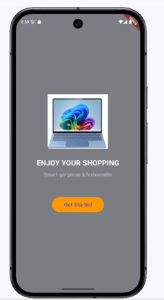
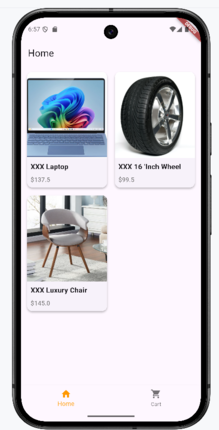
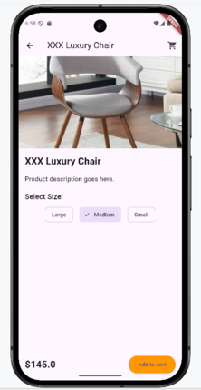
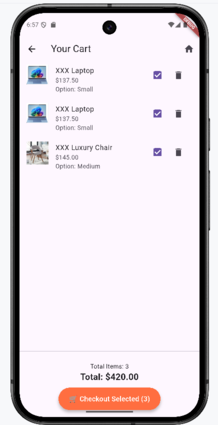

# Flutter Shopping Platform App Demo

This is a mobile shopping demo application built with **Flutter** and **Dart**.  
It demonstrates product listing, detail views, cart management with item selection, and custom UI interactions.

---

## Project Structure

```
exercise_01/              # Root Folder
├── android/              # Android native project files(system generated automatically)
├── ios/                  # iOS native project files(system generated automatically)
├── lib/                 ✅ All Dart source code (UI, models/functions, screens)
│   ├── models/
        ├── cart.dart     # cart functions (adding, removing items in cart, calculating total price, etc...)
        ├── product.dart  # product functions (showing name, price, image of items in the screen)     
│   ├── screens/          # All UI screens (home, detail, cart, welcome, main)
        ├── cart_screen.dart   # screen for cart page
        ├── detail_screen.dart # screen for product details
        ├── home_screen.dart   # screen for home page
        ├── main_screen.dart   # screen for main page, which can navigate to "home" and "cart" page
        ├── welcome_page.dart   # screen for showing details of each product
│   └── main.dart         # App entry point
├── resource/
│   └── images/          ✅ Images used in App 
├── screenshots/          # Screenshots of different pages, used for README file
├── pubspec.yaml         ✅ Dependency manager (don't forget to `flutter pub get`)
├── README.md            ✅ This file
├── README.pdf           ✅ PDF version of README.md

```

---

## IDE Platform for Coding: Android Studio

## Github Url: https://github.com/tantss333/exercise_01.git


## 📲 How to Install and Run the App

1. **Install Flutter SDK**  
   - [Flutter installation guide](https://flutter.dev/docs/get-started/install)

2. **Clone this repository:**
   ```
   git clone https://github.com/tantss333/exercise_01.git
   cd exercise_01
   ``` 

3. **Install dependencies:**
   ```bash
   flutter pub get
   ```

4. **Run the app:**
   - Be sure that load the project from the root folder, for example: **exercise_01**

   - Be sure you **connect your mobile device**(either virtual or practical) in IDE

   - In **Android Studio**: click ▶️ next to `main.dart`

   - In **Intellij**: click ▶️ next to `main.dart`

   - Or via terminal:
     ```bash
     flutter run
     ```

5. **To test on Chrome:**
   ```bash
   flutter config --enable-web
   flutter devices
   flutter run -d chrome
   ```

---

## 🖼 Screenshots


|  |  |
|:--:|:--:|
| Welcome Page | Main Page |

|  |  |
|:--:|:--:|
| Product Details | Cart Page |

---

## ✅ Features Implemented

- 🏠 Welcome screen with navigation
- 🛍 Product listing with image + price
- 📦 Detail screen with size selection + validation
- 🛒 Cart screen with:
  - Total price + item count
  - Multi-select checkboxes
  - Delete item
  - "Checkout selected" button (only button)

---

## ⚠ Notes

- Make sure assets are declared in `pubspec.yaml` (e.g. `resource/images/`)
- If you're using a custom folder like `assets/`, update image paths accordingly

---

## 📌 Author

- Student: Sheng Tan  
- Student ID: 1252550